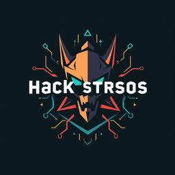
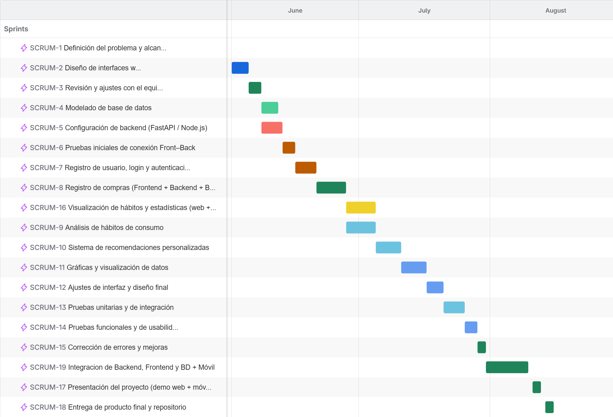

# ConsumoConsciente_TI

### Introduccion.
En la era digital actual, el consumo masivo y la accesibilidad inmediata a bienes y servicios han transformado profundamente los hábitos de compra de las personas. Si bien esta dinámica ofrece comodidad y variedad, también conlleva una creciente desconexión entre el acto de consumir y la conciencia sobre sus repercusiones. Este patrón de consumo impulsivo y poco reflexivo genera consecuencias tangibles que trascienden lo individual: impacta la economía familiar, agrava problemáticas ambientales como la generación excesiva de residuos y la huella de carbono, y perpetúa, en ocasiones, cadenas de producción con prácticas sociales cuestionables.

 Sin embargo, existe una brecha evidente entre el creciente interés por adoptar estilos de vida más responsables y la capacidad real de las personas para materializar este cambio. La intención choca frecuentemente con la falta de herramientas prácticas que permitan visualizar de manera clara, personalizada y accionable el impacto real de las decisiones diarias. Los usuarios carecen de un espejo digital que les refleje no solo cuánto gastan, sino también cómo sus elecciones afectan su entorno.

Es en este contexto donde surge "Consumo Consciente", un proyecto de Tecnologías de la Información diseñado para bridgear esta brecha. La iniciativa consiste en el desarrollo de una plataforma digital integral (compuesta por una aplicación web y móvil) que funciona como un asistente personal para la gestión inteligente del consumo. Su propósito fundamental es empoderar al usuario, transformando datos crudos de sus compras en conocimiento significativo.

A través de un sistema de registro detallado, dashboards interactivos y un motor de recomendaciones personalizadas, la plataforma no solo identifica patrones de gasto, sino que educa y sugiere alternativas más sostenibles y alineadas con los valores del usuario. Al priorizar la usabilidad, la seguridad de los datos y el cumplimiento normativo, "Consumo Consciente" se posiciona no como una simple aplicación de presupuesto, sino como una solución tecnológica holística que busca fomentar un cambio de comportamiento tangible, promoviendo la transición desde un consumo automático hacia uno deliberado, informado y responsable.

### Identidad Grafica

| Logo del Producto | Logo de la Marca |
| --- | --- |
|  |  |

 

### Descripcion

El proyecto "Consumo Consciente" consiste en el diseño, desarrollo e implementación de una plataforma digital integral (compuesta por un sitio web y una aplicación móvil) cuyo propósito fundamental es fomentar el consumo responsable y sostenible entre los usuarios. La plataforma actúa como un asistente personalizado que permite a los individuos registrar y analizar meticulosamente sus hábitos de compra. A través de la captura manual o automática de cada transacción (fecha, categoría, monto), el sistema construye un historial detallado del consumo.

Utilizando herramientas modernas de análisis de datos y visualización, la plataforma transforma esta información cruda en conocimiento accionable. Presenta a los usuarios dashboards interactivos e intuitivos con gráficos y reportes que ilustran sus patrones de gasto a lo largo del tiempo, highlighting áreas de potencial sobreconsumo o impacto negativo. El núcleo inteligente del sistema reside en su módulo de recomendaciones personalizadas, el cual, basado en los patrones identificados y utilizando criterios ecológicos y éticos predefinidos, sugiere alternativas de productos, servicios o hábitos más sostenibles y alineados con los valores del usuario.

Más allá de ser un mero rastreador de gastos, "Consumo Consciente" se erige como una herramienta educativa y de concienciación. Su interfaz inclusiva y responsiva, accesible desde cualquier navegador o dispositivo móvil, está diseñada para empoderar a las personas, facilitándoles la toma de decisiones informadas que benefician no solo su economía personal, sino también el bienestar social y ambiental, promoviendo así un cambio positivo en los comportamientos de consumo.

 

### Planteamiento del problema

En la era del consumo masivo, los individuos se enfrentan a un flujo constante de información publicitaria y opciones de compra, lo que frecuentemente deriva en hábitos de consumo impulsivos y poco reflexivos. Este comportamiento no solo impacta la economía personal, generando gastos superfluos y endeudamiento, sino que tiene profundas repercusiones a nivel global. El consumo desmedido es un motor principal de problemas ambientales críticos, como la explotación desproporcionada de recursos naturales, la generación excesiva de residuos (especialmente plásticos de un solo uso) y el aumento de la huella de carbono asociada a la producción y logística de bienes. Socialmente, perpetúa cadenas de producción que, en ocasiones, priorizan la reducción de costos sobre el cumplimiento de derechos laborales y condiciones éticas.

A pesar de una creciente conciencia sobre estos issues, existe una brecha significativa entre la intención de consumir responsablemente y la acción concreta. Los usuarios carecen de herramientas accesibles y tangibles que les permitan visualizar de manera clara y personalizada el impacto real de sus decisiones diarias. Llevar un registro manual es tedioso y propenso al olvido, mientras que los presupuestos tradicionales se centran únicamente en el aspecto financiero, ignorando por completo la dimensión ecológica y social de las compras.

Este proyecto identifica que la falta de retroalimentación inmediata y visual sobre los patrones de consumo es una barrera clave. Sin datos consolidados y analizados, es virtualmente imposible para una persona identificar tendencias, establecer metas realistas de reducción o tomar decisiones alternativas informadas. Por ello, "Consumo Consciente" surge como una solución tecnológica diseñada para abordar esta problemática directamente, bridgeando la brecha entre la conciencia y la acción al proporcionar insights accionables y personalizados que empoderen al usuario para transformar sus hábitos en beneficio propio y del planeta.

 

### Propuesta de solucion

“Consumo Consciente” se propone como una plataforma digital integral (web y móvil) diseñada para actuar como un puente entre la intención del usuario de consumir de forma responsable y la acción concreta. La solución no es solo un rastreador de gastos, sino un ecosistema educativo y de apoyo que, mediante el análisis de datos y la inteligencia de negocio, empodera al individuo para transformar sus hábitos.

1. Funcionalidad Central y Módulos de Información
La plataforma se estructurará en módulos interconectados que guían al usuario en un ciclo continuo de registro, análisis, aprendizaje y acción:

Módulo de Registro y Gestión de Datos:

Funcionalidad: Captura exhaustiva de cada transacción. Los usuarios pueden ingresar compras manualmente ( fecha, monto, categoría, marca, lugar) o, a futuro, mediante la integración con APIs bancarias (con previa autorización) para una sincronización semi-automática.

Procedimiento: Se implementará un formulario intuitivo con sugerencias y autocompletado para minimizar la fricción en el registro. Todos los datos se almacenarán de forma segura y cifrada.

Módulo de Análisis y Dashboard Interactivo:

Funcionalidad: Corazón de la plataforma. Procesa los datos registrados para generar visualizaciones claras y personalizadas.

Información Presentada:

Gráficos de Evolución: Gastos por categoría a lo largo del tiempo (semana, mes, año).

Análisis Comparativo: Comparativa con períodos anteriores para identificar tendencias.

Alertas Inteligentes: Notificaciones automáticas al detectar patrones de gasto inusuales o excesivos en categorías específicas.

Huella Estimada: Un indicador calculado que aproxima el impacto ambiental (ej., kg de CO₂) basado en las categorías de productos consumidas.

Módulo de Recomendaciones Personalizadas:

Funcionalidad: Sistema inteligente que analiza los patrones del usuario para ofrecer sugerencias accionables.

Tipo de Recomendaciones:

Sustituciones Sostenibles: Sugerir alternativas ecológicas o de comercio local a productos que el usuario compra frecuentemente.

Consejos de Ahorro: Recomendaciones para reducir el consumo en categorías identificadas como problemáticas.

Metas y Desafíos: Propone desafíos personalizados (ej., "reduce un 10% tu gasto en delivery este mes") para gamificar la experiencia y aumentar el engagement.

Módulo de Reportes y Exportación:

Funcionalidad: Permite al usuario exportar su historial y análisis en formatos PDF o CSV para un análisis externo o para compartir con un asesor financiero.

2. Roles de Usuario
Usuario Final/Consumidor: Rol principal. Accede a todas las funcionalidades descritas anteriormente para gestionar y analizar su propio consumo.

Administrador del Sistema: Gestiona la configuración de la plataforma, categorías de productos, criterios de sostenibilidad, da mantenimiento a la base de datos y supervisa el rendimiento del sistema.

3. Arquitectura del Software
La solución seguirá una arquitectura de tres capas (3-Tier) moderna y desacoplada, asegurando escalabilidad, mantenibilidad y seguridad.

Frontend: Desarrollado con Angular para la web, garantizando una SPA (Single Page Application) responsiva y dinámica. La aplicación móvil se desarrollará nativamente para asegurar el mejor rendimiento y acceso a sensores del dispositivo.

Backend: Implementado con FastAPI (Python) por su alto rendimiento y generación automática de documentación. Se encargará de toda la lógica de negocio, autenticación y comunicación con la base de datos.

Base de Datos: Se utilizará un sistema de gestión de bases de datos relacional como MySQL o PostgreSQL para garantizar la integridad y consistencia de los datos transaccionales.

4. Mecanismos de Seguridad
La privacidad y seguridad de los datos financieros y personales del usuario es primordial. Se implementarán las siguientes medidas:

Autenticación Robusta: Login con usuario/contraseña con hashing seguro (bcrypt) y soporte para autenticación de dos factores (2FA) a futuro.

Cifrado de Datos:

En tránsito: Obligatorio uso de HTTPS/TLS en todas las comunicaciones.

En reposo: Cifrado de la base de datos para proteger información sensible como contraseñas y datos personales.

Cumplimiento Legal: Estricta adherencia a la Ley Federal de Protección de Datos Personales en Posesión de los Particulares (LFPDPPP). Políticas de privacidad claras y obtención del consentimiento explícito del usuario para el procesamiento de sus datos.

Principio de Mínimo Privilegio: Los usuarios solo pueden acceder y modificar sus propios datos. No hay acceso cruzado entre cuentas.

5. Aspectos Técnicos Significativos
Escalabilidad: La arquitectura desacoplada permite escalar horizontalmente el backend o la base de datos independientemente según la demanda.

Usabilidad (UX): Diseño centrado en el usuario (DCU) con prototipos en Figma para validar flujos e iterar antes del desarrollo, asegurando una interfaz intuitiva y accesible.

Metodología de Desarrollo: Scrum con sprints de 1-2 semanas, facilitando la adaptación a cambios y la entrega incremental de valor. Herramientas como Jira para la gestión de tareas y GitHub para el control de versiones del código.

Esta propuesta técnica y funcional describe un sistema robusto, seguro y centrado en el usuario, capaz de transformar datos crudos en insights valiosos que promueven un cambio de comportamiento tangible hacia la sostenibilidad.

 

### Objetivo General

Desarrollar e implementar una plataforma digital integral (web y móvil) denominada "Consumo Consciente", cuyo propósito central es fomentar y facilitar el consumo responsable y sostenible entre los usuarios. Esto se logrará mediante un sistema que permita registrar, analizar y visualizar de manera clara y personalizada los hábitos de compra. La plataforma procesará estos datos para generar recomendaciones inteligentes y accionables que ayuden a los usuarios a identificar oportunidades de ahorro, reducir su impacto ambiental y tomar decisiones de consumo más alineadas con sus valores. El objetivo final es empoderar al individuo con información concreta y herramientas educativas, bridgeando la brecha entre la intención de consumir de forma responsable y la acción efectiva, promoviendo así un cambio positivo en sus patrones de consumo.

 

### Objetivos Especificos

- Implementar un módulo de registro de compras que permita a los usuarios capturar de manera manual y organizada cada transacción, almacenando datos clave como monto, categoría, fecha y establecimiento, para construir un historial completo de su consumo.

- Diseñar y desarrollar un dashboard interactivo con visualizaciones gráficas (como tendencias, comparativas y distribución de gastos) que transforme los datos registrados en información clara y comprensible sobre los patrones de consumo del usuario.

- Integrar un sistema de recomendaciones inteligentes basado en el análisis de los hábitos del usuario, que genere sugerencias personalizadas para reducir gastos innecesarios y optar por alternativas más sostenibles y éticas.

- Garantizar la accesibilidad y usabilidad de la plataforma mediante un diseño responsivo que funcione de manera óptima y consistente en navegadores web y dispositivos móviles, priorizando una experiencia de usuario intuitiva.

- Asegurar la privacidad y seguridad de los datos del usuario mediante mecanismos robustos de autenticación, cifrado de información sensible y estricto cumplimiento de la normativa de protección de datos personales.

 

### Organigrama de Trabajo

| Fotografía | Nombre Completo                     | Rol Principal en el Equipo                  |
|------------|------------------------------------|--------------------------------------------|
|  | Alex Amauri Márquez Canales           | Líder de Proyecto / Desarrollador Backend |
|  | Berenice Avila Reyes                  | Desarrolladora Frontend                    |
|  | Jesús Emmanuel Arroyo Rangel          | Analista de Datos / Desarrollador BD       |
|  | Esperanza Cruz Galindo                | Desarrolladora Móvil                        |

 

### Tabla de Colaboradores

| Nombre                                | Matrícula | Rol Principal en el Proyecto            | Función Específica                                                                                                                                     | Enlace a GitHub                                      |
|---------------------------------------|-----------|----------------------------------------|-------------------------------------------------------------------------------------------------------------------------------------------------------|-----------------------------------------------------|
| Alex Amauri Márquez Canales           | 220419    | Líder de Proyecto / Desarrollador Backend | Coordinación del equipo, gestión de tareas, desarrollo de la lógica del servidor (APIs), integración de datos y supervisión de scrapers.            | [GitHub](https://github.com/Alex01Dev)         |
| Berenice Avila Reyes                  | 220717    | Desarrolladora Frontend                 | Diseño e implementación de la interfaz de usuario (UI/UX) utilizando Angular, garantizando usabilidad y una experiencia responsive.                 | [GitHub](https://github.com/Bere-Avila)       |
| Jesús Emmanuel Arroyo Rangel          | 220547    | Analista de Datos / Desarrollador BD    | Análisis y procesamiento de datos, diseño y gestión de la base de datos, implementación de la arquitectura MVC y soporte en lógica de backend.       | [GitHub](https://github.com/des-arrosho)      |
| Esperanza Cruz Galindo                | 220262    | Desarrolladora Móvil                     | Diseño y desarrollo de la aplicación móvil nativa, incluyendo la conexión y sincronización con un smartwatch.                                        | [GitHub](https://github.com/Dulce990)      |
                                                 

 

### Diagrama de Gantt

 

### Lista de Tecnologia

### Frontend
##### **React Core**

##### **Routing & HTTP**

##### **UI & Icons**

##### **Data Visualization**

##### **Templates**

### Backend
##### **Core Framework**

##### **Database & ORM**

##### **Security & Authentication**

##### **Data Science & ML**

##### **Development Tools**

##### **Cloud Services**

##### **Utilities**

  

### Base de Datos
  
  

 
